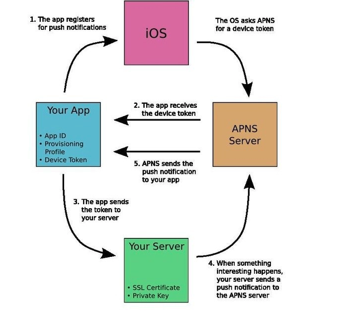

# Apple Push notifications Interview Questions and Answers 

### What is push palyload size in ios11?
*  For regular remote notification, the maximum size is ***4KB*** 4096 bytes. 
*  For Voice over internet protocol notifications, the maximum size is 5kb 

### What is Apns providers?
Apns can store and forward noitications for a device that is currently offline. 
Apns coaleseces notification with same identifier

### What is push notifications? How it works?

### What is p12 and pem file

***p12*** : .p12 is an alternate extension for what is generally referred to as a "PFX file", it's the combined format that holds the private key and certificate and is the format most modern signing utilities use. Same with alternate extensions are .PFX, .PKCS12 

***pem*** : this is a container format that may include just the public certificate (such as with Apache installs, and CA certificate files /etc/ssl/certs), or may include an entire certificate chain including public key, private key, and root certificates. 